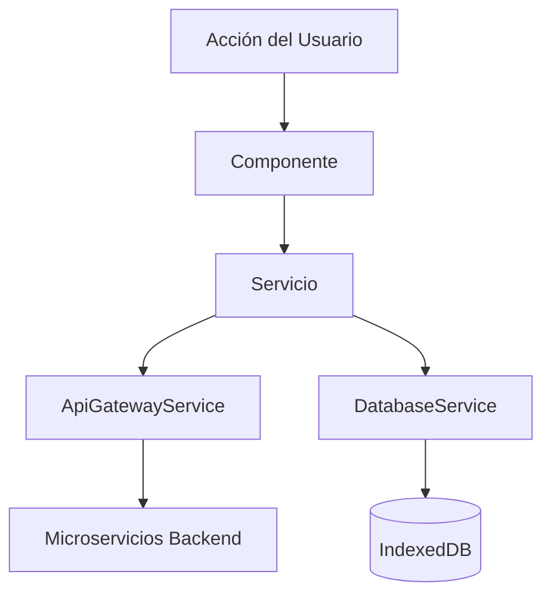

# Arquitectura - Diabetify

## Visión General

Diabetify es una aplicación móvil Ionic/Angular que se comunica con un backend de microservicios a través de un API Gateway centralizado.

El backend (en repositorios separados) expone servicios para autenticación, lecturas de glucosa y citas médicas.

## Patrón API Gateway

Toda la comunicación con el backend se realiza a través del servicio API Gateway.

### Servicio Gateway (Frontend)

- **Ubicación**: `src/app/core/services/api-gateway.service.ts`
- **URL Base**: `environment.backendServices.apiGateway.baseUrl`

**Responsabilidades**:

- Enrutamiento centralizado de requests
- Inyección automática de tokens de autenticación
- Transformación de respuestas
- Estandarización de errores
- Estrategia de caché
- Reintentos con backoff exponencial

### Backend Microservicios

| Servicio         | Puerto | Endpoints                   |
| ---------------- | ------ | --------------------------- |
| **api-gateway**  | 8000   | Punto de entrada único      |
| **glucoserver**  | -      | `/glucose/*` - lecturas     |
| **appointments** | -      | `/appointments/*` - citas   |
| **login**        | -      | `/users/*`, `/token` - auth |

### Excepciones Aprobadas

Los siguientes servicios pueden hacer llamadas HTTP directas:

1. **ExternalServicesManagerService** - Solo para health checks

## Arquitectura de Servicios

### Capa de Autenticación

- **UnifiedAuthService**: Coordina todos los flujos de autenticación
- **LocalAuthService**: Gestiona autenticación con backend local

### Capa de Datos

- **DatabaseService**: Gestión de Dexie/IndexedDB
- **ReadingsService**: Lecturas de glucosa con caché
- **AppointmentService**: Citas médicas
- **ProfileService**: Gestión de perfil de usuario

### Capa de Integración

- **ApiGatewayService**: Comunicación centralizada con backend
- **ExternalServicesManagerService**: Monitoreo de salud de servicios

## Flujo de Datos

## Estrategia Offline-First

1. **Lectura**: Verificar caché en IndexedDB primero
2. **Red**: Obtener de API si no hay caché o está obsoleto
3. **Actualización**: Almacenar respuesta en caché
4. **Sincronización**: Sync en background cuando hay conexión

## Testing

- **Tests Unitarios**: Vitest 4.0 para servicios y componentes
- **Tests E2E**: Playwright para flujos de usuario
- **Tests de Integración**: Vitest + MSW para verificar interacciones entre servicios

## Seguridad

- Tokens JWT para servicios backend
- Manejo de refresh de tokens
- Almacenamiento seguro con Capacitor Preferences

## Rendimiento

- Caché en IndexedDB
- Debouncing de requests
- Lazy loading de rutas
- Optimización de imágenes
- Objetivo de bundle: <2MB inicial

## Common Gotchas

Esta sección documenta problemas comunes y sus soluciones para evitar errores recurrentes.

### Angular Gotchas

| Problema                                      | Causa                              | Solución                                                                    |
| --------------------------------------------- | ---------------------------------- | --------------------------------------------------------------------------- |
| Componente no reconoce elementos Ionic        | Falta `CUSTOM_ELEMENTS_SCHEMA`     | Agregar `schemas: [CUSTOM_ELEMENTS_SCHEMA]` en `@Component`                 |
| `ExpressionChangedAfterItHasBeenCheckedError` | Cambio de estado en lifecycle hook | Usar `ChangeDetectorRef.detectChanges()` o mover lógica a `ngAfterViewInit` |
| `NullInjectorError` en tests                  | Provider no configurado            | Agregar mock al array de `providers` en `TestBed.configureTestingModule()`  |
| Componente standalone no importa dependencias | Angular 21 standalone pattern      | Agregar componentes/pipes/directivas a `imports: []` en `@Component`        |
| Change detection no actualiza vista           | Componente usa `OnPush`            | Llamar `cdr.markForCheck()` después de cambios async                        |

### Ionic Gotchas

| Problema                                                 | Causa                   | Solución                                                                                       |
| -------------------------------------------------------- | ----------------------- | ---------------------------------------------------------------------------------------------- |
| `ion-button` no tiene role="button"`                     | Ionic usa shadow DOM    | Usar `[attr.aria-label]` y test con `getByRole('button')` puede fallar - usar `data-testid`    |
| Modal/popover no aplica estilos                          | CSS encapsulado         | Usar `::part()` selector o variables CSS `--background`, `--color`                             |
| `ion-datetime` números desaparecen al scroll             | Bug de rendering        | Agregar `will-change: transform` y `backface-visibility: hidden`                               |
| Forms con `ion-input` + `formControlName` fallan en test | Lifecycle timing        | No llamar `fixture.detectChanges()` inmediatamente, inicializar form en `ngOnInit()`           |
| Dark mode no aplica                                      | Clases no sincronizadas | `ThemeService` debe agregar `.dark`, `.ion-palette-dark` Y `data-theme="dark"` simultáneamente |

### Capacitor Gotchas

| Problema                                | Causa                      | Solución                                                         |
| --------------------------------------- | -------------------------- | ---------------------------------------------------------------- |
| Plugin no funciona en web               | API nativa                 | Verificar `Capacitor.isNativePlatform()` antes de llamar plugins |
| `Preferences.get()` retorna `undefined` | Key no existe              | Siempre verificar `value !== null` antes de usar                 |
| `Network.getStatus()` inconsistente     | Emulador vs real           | Usar mock en desarrollo, test en dispositivo real                |
| Deep links no funcionan                 | AndroidManifest incompleto | Agregar `intent-filter` con scheme y host correctos              |
| Splash screen se queda                  | `autoHide` habilitado      | Llamar `SplashScreen.hide()` manualmente después de init         |

### IndexedDB / Dexie Gotchas

| Problema                        | Causa                     | Solución                                                                  |
| ------------------------------- | ------------------------- | ------------------------------------------------------------------------- |
| `PrematureCommitError` en tests | Transaction auto-commit   | Usar `fake-indexeddb` v6+ y no mezclar `await` con callbacks              |
| Datos de otro usuario aparecen  | Query sin filtro `userId` | Siempre filtrar por `userId` en queries de `ReadingsService`              |
| `ConstraintError` en put        | Clave duplicada           | Verificar si registro existe antes de insertar, o usar `put()` con upsert |
| Base de datos vacía en tests    | DB no inicializada        | Importar `test-setup.ts` que inicializa `fake-indexeddb`                  |
| Migraciones no corren           | Version mismatch          | Incrementar `version` en `DiabetacticDatabase` al cambiar schema          |

### Tailwind + DaisyUI Gotchas

| Problema                   | Causa                    | Solución                                                                                 |
| -------------------------- | ------------------------ | ---------------------------------------------------------------------------------------- |
| Clases no aplican          | Purge eliminó la clase   | Agregar clase a `safelist` en `tailwind.config.js` o usar en template                    |
| Conflicto Ionic/Tailwind   | Reset de estilos         | Usar `@aparajita/tailwind-ionic` para integración correcta                               |
| Dark mode inconsistente    | Selector incorrecto      | DaisyUI usa `data-theme`, Tailwind usa `.dark` - sincronizar ambos                       |
| Colores no cambian en dark | Variable CSS no definida | Definir variable en ambos `:root[data-theme='diabetactic']` y `:root[data-theme='dark']` |

### Multi-Usuario Gotchas

| Problema                           | Causa                             | Solución                                                                |
| ---------------------------------- | --------------------------------- | ----------------------------------------------------------------------- |
| Datos de usuario anterior aparecen | IndexedDB no filtra por userId    | `ReadingsService.setCurrentUser()` debe llamarse en login/restore       |
| Datos huérfanos persisten          | Logout no limpia userId diferente | `clearOrphanedDataIfNeeded()` elimina datos de otros usuarios           |
| `currentUserId$` es null           | No se llamó `setCurrentUser()`    | `LocalAuthService.initializeAuthState()` debe llamar `setCurrentUser()` |

### Password Recovery Gotchas

| Problema         | Causa                           | Solución                                        |
| ---------------- | ------------------------------- | ----------------------------------------------- |
| Email no llega   | Backend no configurado          | Verificar configuración SMTP en backend `login` |
| Token expirado   | Más de 15 minutos               | Usuario debe solicitar nuevo token              |
| Validación falla | Contraseña no cumple requisitos | Frontend debe validar antes de enviar           |

### Testing Gotchas

| Problema                            | Causa                               | Solución                                                   |
| ----------------------------------- | ----------------------------------- | ---------------------------------------------------------- |
| `fakeAsync` no funciona con `await` | Zone.js no trackea Promises nativas | Usar `tick()` o `await flushMicrotasks()`                  |
| Screenshots E2E difieren en CI      | Fuentes y rendering diferente       | Usar `maxDiffPixelRatio: 0.1` o actualizar baselines en CI |
| MSW handler no intercepta requests  | Orden de handlers incorrecto        | Handlers específicos primero, genéricos después            |
| Router mock falla con `canActivate` | Falta `createUrlTree`               | Agregar: `createUrlTree: vi.fn(), serializeUrl: vi.fn()`   |

### Medical/Algorithm Gotchas

| Problema                                         | Causa                               | Solución                                               |
| ------------------------------------------------ | ----------------------------------- | ------------------------------------------------------ |
| Valores de glucosa categorizados incorrectamente | Conversión de unidades con redondeo | Comparar siempre en mg/dL, redondear solo para display |
| Lecturas aparecen en día incorrecto              | Timezone handling inconsistente     | Almacenar ISO 8601, filtrar con timezone del usuario   |
| eA1C muy diferente de A1C real                   | Pocos datos o factores individuales | Requerir mínimo 14 días, mostrar disclaimer            |
